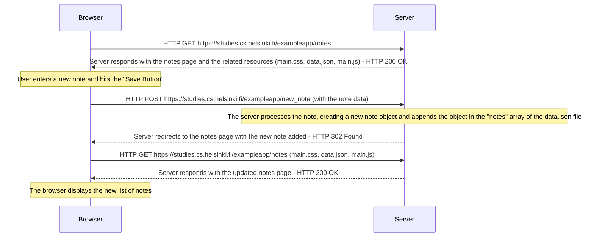

```mermaid
sequenceDiagram
    participant A as Browser
    participant B as Server
    A->>B: HTTP GET https://studies.cs.helsinki.fi/exampleapp/notes
    B-->>A: Server responds with the notes page and the related resources (main.css, data.json, main.js) - HTTP 200 OK
    Note over A: User enters a new note and hits the "Save Button"
    A->>B: HTTP POST https://studies.cs.helsinki.fi/exampleapp/new_note (with the note data)
    Note over B: The server processes the note, creating a new note object and appends the object in the "notes" array of  the data.json file
    B-->>A: Server redirects to the notes page with the new note added - HTTP 302 Found
    A->>B: HTTP GET https://studies.cs.helsinki.fi/exampleapp/notes (main.css, data.json, main.js)
    B-->>A: Server responds with the updated notes page - HTTP 200 OK
    Note over A: The browser displays the new list of notes
```