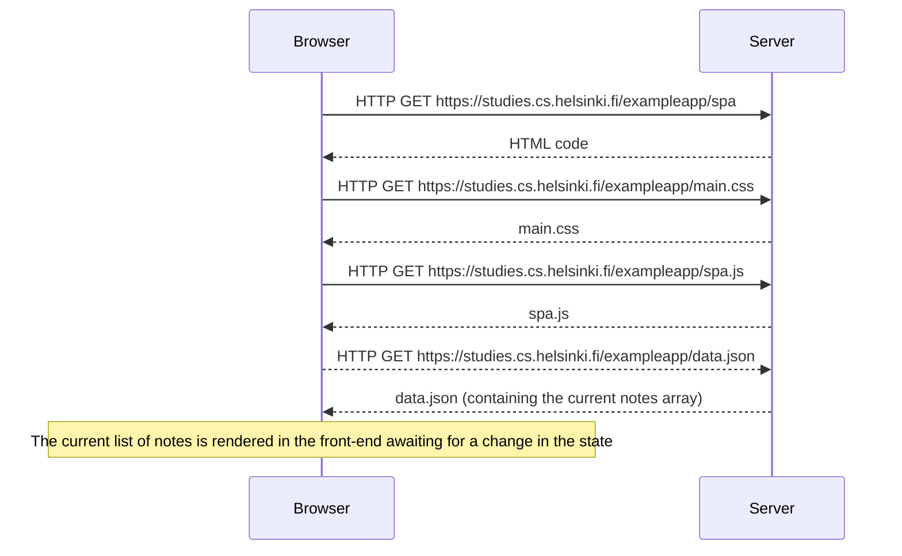

```mermaid
sequenceDiagram
    participant B as Browser
    participant S as Server

    B ->> S: HTTP GET https://studies.cs.helsinki.fi/exampleapp/spa
    S -->> B: HTML code
    B ->> S: HTTP GET https://studies.cs.helsinki.fi/exampleapp/main.css
    S -->> B: main.css
    B ->> S: HTTP GET https://studies.cs.helsinki.fi/exampleapp/spa.js
    S -->> B: spa.js
    B -->> S: HTTP GET https://studies.cs.helsinki.fi/exampleapp/data.json
    S -->> B: data.json (containing the current notes array)
    Note over B: The current list of notes is rendered in the front-end awaiting for a change in the state
```

