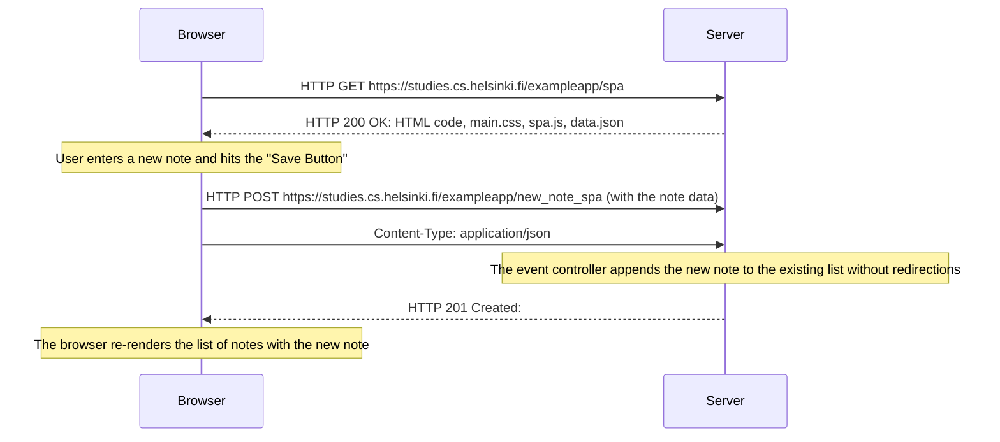

```mermaid
sequenceDiagram
    Participant B as Browser
    Participant S as Server
    B ->> S: HTTP GET https://studies.cs.helsinki.fi/exampleapp/spa
    S -->> B: HTTP 200 OK: HTML code, main.css, spa.js, data.json
    Note over B: User enters a new note and hits the "Save Button"
    B->>S: HTTP POST https://studies.cs.helsinki.fi/exampleapp/new_note_spa (with the note data)
    B->>S: Content-Type: application/json
    Note over S: The event controller appends the new note to the existing list without redirections
    S -->> B: HTTP 201 Created:
    Note over B: The browser re-renders the list of notes with the new note
```